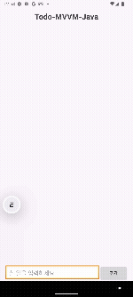

# Todo-MVVM-Java

### 프로젝트 설명  
이 프로젝트는 **MVVM 패턴 실습**에 초점을 맞춘 간단한 TodoList 앱입니다.  
Room 데이터베이스를 활용하여 로컬에 데이터를 저장하며, View ↔ ViewModel ↔ Model 간의 역할을 분리하는 것을 실습하였습니다.  

---

## 🛠️ 기술 스택  

- **언어 (Languages)**: Java, XML  
- **개발 환경**: Android Studio  
- **아키텍처 (Architecture)**: MVVM (Model-View-ViewModel)  
- **데이터베이스 (Database)**: Room  

---

## 🔄 앱 구조 및 흐름  

앱은 **Room DB → Repository → ViewModel → View** 흐름을 기반으로 동작합니다.  

---

### 1. Room DB (Model 계층)

DB 접근을 위한 `Dao` 인터페이스를 정의합니다.  
LiveData를 반환하여 데이터 변경 시 자동으로 UI에 반영되도록 합니다.  

```java
@Dao
public interface TodoDao {
    @Query("SELECT * FROM TODOENTITY")
    LiveData<List<TodoEntity>> getAllData();

    @Insert(onConflict = OnConflictStrategy.REPLACE)
    void setInsertTodo(TodoEntity todo);

    @Query("DELETE FROM TodoEntity")
    void deleteAllTodo();

    @Query("DELETE FROM TodoEntity WHERE id = :id")
    void deleteDataWhereId(int id);
}
````

---

### 2. [Repository](app/src/main/java/com/project/todolistjava/TodoRoom/TodoRepository.java)

Repository는 DB 접근 로직을 캡슐화하여 ViewModel이 데이터 소스를 직접 알지 않아도 되도록 합니다.
비동기 처리를 위해 `Executor`를 사용합니다.

```java
public class TodoRepository {
    private TodoDao dao;
    private LiveData<List<TodoEntity>> allData;
    private Executor executor = Executors.newSingleThreadExecutor();

    public TodoRepository(Application application) {
        TodoDB db = TodoDB.getDatabase(application);
        dao = db.dao();
        allData = dao.getAllData();
    }

    public LiveData<List<TodoEntity>> getAllData() {
        return allData;
    }

    public void InsertData(TodoEntity todoEntity) {
        executor.execute(() -> dao.setInsertTodo(todoEntity));
    }

    public void deleteAllData() {
        executor.execute(() -> dao.deleteAllTodo());
    }

    public void deleteDataWhereId(int id) {
        executor.execute(() -> dao.deleteDataWhereId(id));
    }
}
```

---

### 3. [ViewModel](app/src/main/java/com/project/todolistjava/Todo_ViewModel.java)

ViewModel은 Repository를 통해 데이터를 가져오고, `LiveData`로 관리하여 View에 전달합니다.
UI 관련 로직과 데이터 보존 역할을 담당합니다.

```java
public class Todo_ViewModel extends AndroidViewModel {
    private TodoRepository repository;
    private LiveData<List<TodoEntity>> liveData;

    public Todo_ViewModel(@NonNull Application application) {
        super(application);
        repository = new TodoRepository(application);
        liveData = repository.getAllData();
    }

    public LiveData<List<TodoEntity>> getAllData() {
        return liveData;
    }

    public void insertData(TodoEntity data) {
        repository.InsertData(data);
    }

    public void deleteAllData() {
        repository.deleteAllData();
    }

    public void deleteDataWhereId(int id) {
        repository.deleteDataWhereId(id);
    }
}
```

---

### 4. View ([MainActivity](app/src/main/java/com/project/todolistjava/MainActivity.java) & [Adapter](app/src/main/java/com/project/todolistjava/todoRecycler/Todo_Adpater.java))

View는 **사용자 입력을 처리**하고, ViewModel의 `LiveData`를 **관찰(Observer)** 하여 자동으로 UI를 업데이트합니다.

#### LiveData 관찰 (자동 업데이트)

```java
viewModel.getAllData().observe(this, todoData -> {
    adapter.setData(todoData);
    adapter.notifyDataSetChanged();
});
```

➡️ LiveData 값이 변경될 때마다 RecyclerView UI가 자동 갱신됩니다.

#### 사용자 입력 처리

```java
binding.btnAdd.setOnClickListener(it -> {
    String todoList = binding.etTodo.getText().toString().trim();
    if (todoList.isEmpty()) {
        Toast.makeText(this, "할일을 입력해주세요", Toast.LENGTH_SHORT).show();
    } else {
        TodoEntity data = new TodoEntity();
        data.setTodo(todoList);
        viewModel.insertData(data);
    }
});
```

#### RecyclerView Adapter

```java
@Override
public void onBindViewHolder(@NonNull Todo_Adpater.Viewholder holder, int position) {
    holder.todo.setText(data.get(position).getTodo());
    holder.delete.setOnClickListener(it -> {
        listener.deleteClick(data.get(position).getId());
    });
}
```

➡️ 삭제 버튼 클릭 → Adapter 콜백 실행 → ViewModel의 `deleteDataWhereId()` 호출 → Repository → Room DB 삭제 → LiveData 변경 → UI 자동 반영

---

## 📌 전체 데이터 흐름 요약

1. **사용자 입력 (추가/삭제)** → `MainActivity` → `ViewModel` 호출
2. **ViewModel** → `Repository` 통해 DB 요청 위임
3. **Repository** → `Room DB` 접근 (비동기 처리)
4. **DB 변경** → `LiveData` 업데이트 → `ViewModel` → `View` 자동 반영

---

## 📱 주요 기능

* Todo 추가
* Todo 삭제
* Room DB를 통한 데이터 영구 저장
* LiveData & Observer를 통한 **실시간 UI 업데이트**

---

## 📊 구조 다이어그램 (Markdown)

```text
사용자 입력
    ↓
   View (MainActivity / Adapter)
    ↓
 ViewModel (Todo_ViewModel)
    ↓
 Repository (TodoRepository)
    ↓
 Room DB (TodoDao, TodoEntity)
    ↓
 LiveData 업데이트
    ↓
 View 자동 반영 (Observer)
```
---

## 실행 화면 (Screenshots & GIFs)


   

